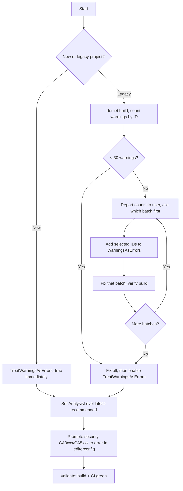

# .NET Code Analysis

## Trigger On

- the repo wants first-party .NET analyzers
- CI should fail on analyzer warnings
- the team needs `AnalysisLevel` or `AnalysisMode` guidance
- the repo needs a gradual Roslyn warning promotion strategy

## Do Not Use For

- third-party analyzer selection by itself
- formatting-only work

## Inputs

- the nearest `AGENTS.md`
- project files or `Directory.Build.props`
- current analyzer severity policy

## Hard Rules for AI Agents

Non-negotiable. Violating these undermines the user's explicit intent.

1. Never disable or remove `TreatWarningsAsErrors` or `WarningsAsErrors` if the project has set them. Do not comment them out, set to `false`, wrap in a condition, or add `<TreatWarningsAsErrors>false</TreatWarningsAsErrors>` to make the build pass.
2. Never add `<NoWarn>` or `#pragma warning disable` for warnings the user chose to treat as errors, unless the user explicitly approves the suppression.
3. Never silently downgrade severity in `.editorconfig` (e.g. `error` to `warning` or `none`) to make a build succeed.
4. If warnings-as-errors breaks the build — fix the code. If the fix is too large, ask the user whether to defer that warning ID.
5. If warning volume is too large to fix in one pass — report count and categories to the user and ask which to tackle first. Do not unilaterally disable the policy.

## Workflow



1. Start with SDK analyzers before third-party packages.
2. Detect project maturity: new or existing/legacy.
3. Enable `EnableNETAnalyzers`, `AnalysisLevel`, `AnalysisMode` in `Directory.Build.props`.
4. Apply the right warning promotion strategy (see below).
5. Per-rule severity goes in repo-root `.editorconfig`.
6. `dotnet build` is the analyzer gate in CI.

## Warning Promotion Strategy

### New Projects

Set these in `Directory.Build.props` immediately:
- `TreatWarningsAsErrors` = true
- `AnalysisLevel` = latest-recommended
- Security category = error in `.editorconfig`

Fix all warnings before merging.

### Legacy Projects — Gradual Promotion

Blanket `TreatWarningsAsErrors` on a legacy codebase produces hundreds/thousands of errors. An agent cannot fix them all at once — context floods, fix quality drops. Promote in batches.

#### Phase 1: Trivial Hygiene (start here)

Mechanical fixes, lowest effort:
- CS8019 — unnecessary using directive (remove it)
- CS0219 — variable assigned but never used (remove it)
- CS0168 — variable declared but never used (remove it)
- CS1591 — missing XML comment for public member (add comment or disable for internal code)
- CS0612 — obsolete member used, no message (replace with non-obsolete API)
- CS0618 — obsolete member used, with message (follow migration guidance)

Add to `WarningsAsErrors`: `CS8019;CS0219;CS0168`. Fix all, then Phase 2.

#### Phase 2: Code Quality (ask user which categories)

- CA2000 — dispose objects before losing scope (Reliability)
- CA1062 — validate public method arguments (Design)
- CA1822 — mark members as static (Performance)
- CA1860 — avoid Enumerable.Any() for length check (Performance)
- CA1861 — avoid constant arrays as arguments (Performance)
- CA2007 — consider calling ConfigureAwait (Reliability)
- CS8600–CS8610 — nullable reference type warnings (Nullability)

Ask: "Which categories next — Nullability, Performance, or Reliability?" Add selected IDs to `WarningsAsErrors`, fix, repeat.

#### Phase 3: Security (always promote early)

Set in `.editorconfig` regardless of project maturity:
```editorconfig
[*.cs]
dotnet_analyzer_diagnostic.category-Security.severity = error
```

Covers CA3001 (SQL injection), CA3002 (XSS), CA3003 (path injection), CA3075 (insecure DTD), CA5350/CA5351 (weak crypto), CA5394 (insecure randomness).

#### Phase 4: Full Coverage

Once all batches pass, transition to:
```xml
<TreatWarningsAsErrors>true</TreatWarningsAsErrors>
<WarningsNotAsErrors>CA1707</WarningsNotAsErrors> <!-- explicit exceptions only -->
```

### Interaction Protocol (legacy codebases)

1. Run `dotnet build`, count warnings by ID.
2. Report summary: "Found 47 CS8019, 23 CA1822, 12 CA2000, 8 CS8600."
3. Ask which batch to tackle. Recommend starting with Phase 1.
4. Fix selected batch, verify build.
5. Add those IDs to `WarningsAsErrors`.
6. Report back, ask about next batch.

Never skip the ask step. The user decides the pace.

## Bootstrap When Missing

1. Detect current state:
   - `dotnet --info`
   - `rg -n "EnableNETAnalyzers|AnalysisLevel|AnalysisMode|TreatWarningsAsErrors|WarningsAsErrors" -g '*.csproj' -g 'Directory.Build.*' .`
   - `dotnet build SOLUTION_OR_PROJECT 2>&1` — count warnings by ID
2. Classify: new (few/zero warnings) vs legacy (many warnings).
3. Enable `EnableNETAnalyzers`, `AnalysisLevel`, `AnalysisMode` in MSBuild config.
4. Apply promotion strategy matching project maturity.
5. Per-rule severity in repo-root `.editorconfig`.
6. Run `dotnet build`, return `status: configured` or `status: improved`.
7. If repo defers analyzer policy to another build layer, return `status: not_applicable`.

## Deliver

- explicit, reviewable first-party analyzer policy
- build-time analyzer execution for CI
- warning promotion plan matching project maturity

## Validate

- analyzer behavior driven by repo config, not IDE defaults
- CI reproduces same warnings/errors locally
- no `TreatWarningsAsErrors`, `WarningsAsErrors`, or severity settings removed/weakened without user approval
- promoted warnings produce build errors, not just IDE hints

## Ralph Loop

1. Plan: analyze state, define target, constraints, risks, execution plan, validation steps.
2. Execute one step, produce concrete delta.
3. Review result, capture findings.
4. Apply fixes in small batches, rerun checks.
5. Update plan after each iteration.
6. Repeat until acceptable or only explicit exceptions remain.
7. Missing dependency: bootstrap or return `status: not_applicable`.

### Required Result Format

- `status`: `complete` | `clean` | `improved` | `configured` | `not_applicable` | `blocked`
- `plan`: concise plan and current step
- `actions_taken`: concrete changes
- `validation_skills`: final skills run or skipped with reasons
- `verification`: commands, checks, or review evidence
- `remaining`: unresolved items or `none`

## Load References

- [references/rules.md](references/rules.md)
- [references/config.md](references/config.md)
- [references/code-analysis.md](references/code-analysis.md)

## Example Requests

- "Turn on built-in .NET analyzers."
- "Make analyzer warnings fail the build."
- "Set the right AnalysisLevel for this repo."
- "Start treating unused usings and unused variables as errors."
- "Help me gradually promote Roslyn warnings in my legacy project."
- "Which warnings should I promote to errors next?"
