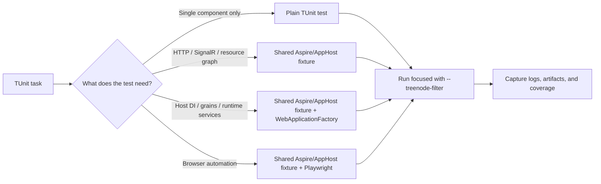

# TUnit

## Trigger On

- the repo uses TUnit
- you need to add, run, debug, or repair TUnit tests
- the repo uses Microsoft.Testing.Platform-based test execution
- the repo uses `ClassDataSource<...>(Shared = SharedType.PerTestSession)`, `ParallelLimiter`, `TUnit.Playwright`, or `--treenode-filter`

## Value

- produce a concrete project delta: code, docs, config, tests, CI, or review artifact
- reduce ambiguity through explicit planning, verification, and final validation skills
- leave reusable project context so future tasks are faster and safer

## Do Not Use For

- xUnit projects
- MSTest projects
- generic test strategy with no TUnit-specific mechanics

## Inputs

- the nearest `AGENTS.md`
- the test project file and package references
- the repo's current TUnit execution command

## Quick Start

1. Read the nearest `AGENTS.md` and confirm scope and constraints.
2. Run this skill's `Workflow` through the `Ralph Loop` until outcomes are acceptable.
3. Return the `Required Result Format` with concrete artifacts and verification evidence.

## Workflow

1. Confirm the project really uses TUnit and not a different MTP-based framework.
2. Read the repo's real `test` command from `AGENTS.md`. If the repo has no explicit command yet, start with `dotnet test PROJECT_OR_SOLUTION`.
3. Keep the TUnit execution model intact:
   - tests are source-generated at build time
   - tests run in parallel by default
   - built-in analyzers should remain enabled
4. Choose the fixture level deliberately:
   - plain TUnit tests for isolated logic
   - shared AppHost/Aspire fixtures for HTTP, SignalR, SSE, or UI flows
   - `WebApplicationFactory` layered over shared Aspire infra when tests need Host DI services, `IGrainFactory`, or other runtime internals
5. Reuse expensive fixtures with `ClassDataSource<Fixture>(Shared = SharedType.PerTestSession)` instead of booting distributed infrastructure per test.
6. Fix isolation bugs instead of globally serializing the suite unless the repo already documented a justified exception.
7. Run the narrowest useful scope first with `dotnet test ... -- --treenode-filter "..."`. Keep TUnit arguments after `--`.
8. Capture useful failure evidence: host log dumps, focused console output, coverage files, and Playwright screenshots/HTML for UI tests.
9. Use `[Test]`, `[Arguments]`, hooks, and dependencies only when they make the scenario clearer, not because the framework allows it.

## Bootstrap When Missing

If `TUnit` is requested but not configured yet:

1. Detect current state:
   - `rg -n "TUnit|Microsoft\\.Testing\\.Platform" -g '*.csproj' -g 'Directory.Build.*' .`
2. Add the minimal package set to the test project:
   - `dotnet add TEST_PROJECT.csproj package TUnit`
   - add `Microsoft.NET.Test.Sdk` only when the repo's chosen TUnit project shape requires it; do not blindly duplicate runner packages
3. Keep the runner model explicit in `AGENTS.md` and CI:
   - record that the repo uses Microsoft.Testing.Platform-compatible execution for this test project
   - record the exact `dotnet test TEST_PROJECT.csproj` command the repo will use
4. Add one small executable test using `[Test]`.
5. Run `dotnet test TEST_PROJECT.csproj` and return `status: configured` or `status: improved`.
6. If the repo intentionally standardizes on xUnit or MSTest, return `status: not_applicable` unless migration is explicitly requested.

## Deliver

- TUnit tests that respect source generation and parallel execution
- commands that work in local and CI runs
- framework-specific verification guidance for the repo
- a fixture strategy that matches the actual test scope: logic-only, AppHost/API, Host DI/grains, or Playwright UI

## Validate

- the command matches the repo's TUnit runner style
- focused runs use `--treenode-filter` rather than VSTest-style `--filter`
- shared distributed fixtures use `SharedType.PerTestSession` or an equivalent reuse pattern
- shared state is isolated or explicitly controlled
- built-in TUnit analyzers remain active
- coverage tooling matches Microsoft.Testing.Platform if coverage is enabled
- UI failures capture artifacts and server-side failures expose enough logs to avoid blind reruns

## Test Harness



## Ralph Loop

Use the Ralph Loop for every task, including docs, architecture, testing, and tooling work.

1. Plan first (mandatory):
   - analyze current state
   - define target outcome, constraints, and risks
   - write a detailed execution plan
   - list final validation skills to run at the end, with order and reason
2. Execute one planned step and produce a concrete delta.
3. Review the result and capture findings with actionable next fixes.
4. Apply fixes in small batches and rerun the relevant checks or review steps.
5. Update the plan after each iteration.
6. Repeat until outcomes are acceptable or only explicit exceptions remain.
7. If a dependency is missing, bootstrap it or return `status: not_applicable` with explicit reason and fallback path.

### Required Result Format

- `status`: `complete` | `clean` | `improved` | `configured` | `not_applicable` | `blocked`
- `plan`: concise plan and current iteration step
- `actions_taken`: concrete changes made
- `validation_skills`: final skills run, or skipped with reasons
- `verification`: commands, checks, or review evidence summary
- `remaining`: top unresolved items or `none`

For setup-only requests with no execution, return `status: configured` and exact next commands.

## Load References

- [references/patterns.md](references/patterns.md)
- [references/migration.md](references/migration.md)
- [references/tunit.md](references/tunit.md)
- [references/integration-testing.md](references/integration-testing.md)

## Running Tests

TUnit uses Microsoft.Testing.Platform. Use `--treenode-filter` for filtering (not `--filter`), and keep runner switches after `--`.

```bash
# Run all tests
dotnet test MySolution.sln

# Run one test project
dotnet test tests/MyProject.Tests/MyProject.Tests.csproj

# Filter by class
dotnet test tests/MyProject.Tests/MyProject.Tests.csproj -- --treenode-filter "/*/*/CalculatorTests/*"

# Filter by category
dotnet test tests/MyProject.Tests/MyProject.Tests.csproj -- --treenode-filter "/*/*/*/*[Category=Integration]"

# Coverage on Microsoft.Testing.Platform
dotnet test MySolution.sln -- --coverage --coverage-output coverage.cobertura.xml --coverage-output-format cobertura

# Raw runner help when the repo needs direct TUnit app switches
dotnet run --project tests/MyProject.Tests/MyProject.Tests.csproj -- --help
```

Filter syntax: `/<Assembly>/<Namespace>/<Class>/<Test>` with `*` wildcards. See [references/patterns.md](references/patterns.md) for full examples.

## Example Requests

- "Run this TUnit project correctly."
- "Fix our TUnit CI command."
- "Add a regression test in TUnit without breaking parallelism."
