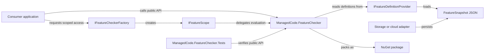
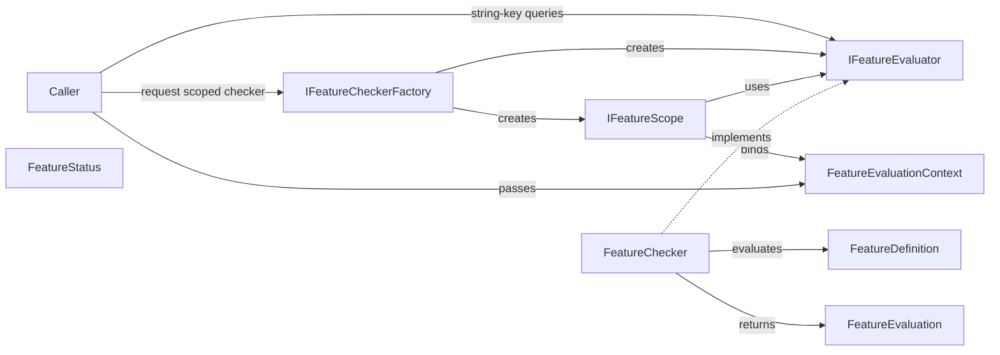
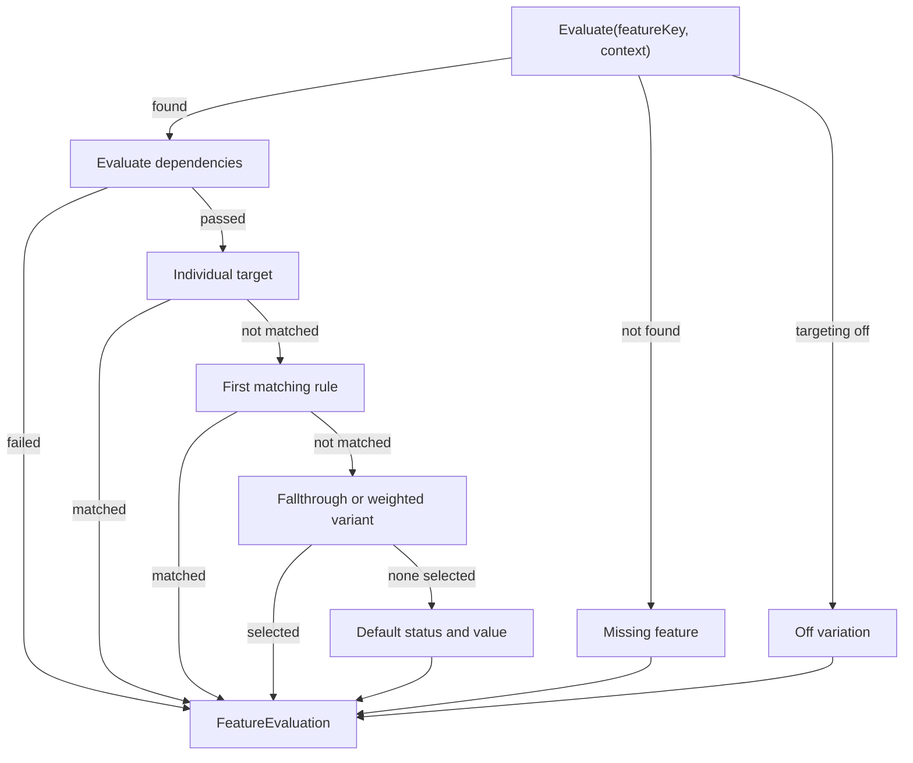

# FeatureChecker Architecture

Goal: understand the public contracts, evaluation model, storage boundary, and release verification flow.

## Summary

- System: a provider-agnostic .NET feature flag evaluator.
- Code: `ManagedCode.FeatureChecker/` contains the packageable library as vertical slices; `ManagedCode.FeatureChecker.Tests/` mirrors those slices with TUnit tests.
- Platform entry points: `IFeatureEvaluator`, `IFeatureSetBuilder`, `IFeatureCheckerFactory`, `IFeatureScope`, `FeatureEvaluationContext`, `FeatureDefinition`, `FeatureSnapshot`, `FeatureSnapshotSerializer`, and `FeatureSetBuilder`.
- Evaluation capabilities: individual targets, segments, context rules, version rules, dependencies, fallthrough/off variations, weighted rollouts, typed variation details, and evaluation reasons.
- Dependencies: production code uses small Microsoft.Extensions packages for DI/options/configuration integration; tests use TUnit, Shouldly, and coverage tooling.

## Scoping

- Start with the module map below, then read the local `AGENTS.md` for the project being changed.
- Public API or semantics changes belong in the production project and must include tests.
- Test-only changes belong in `ManagedCode.FeatureChecker.Tests/`.
- CI, release, and package publishing work belongs in `.github/workflows/`, `Directory.Build.props`, and package metadata files.

## Diagrams

### System Map

### Contracts Map

### Evaluation Model

## Navigation Index

### Modules

- `ManagedCode.FeatureChecker` - code: [ManagedCode.FeatureChecker/](../ManagedCode.FeatureChecker/); local rules: [ManagedCode.FeatureChecker/AGENTS.md](../ManagedCode.FeatureChecker/AGENTS.md).
- `ManagedCode.FeatureChecker.Tests` - code: [ManagedCode.FeatureChecker.Tests/](../ManagedCode.FeatureChecker.Tests/); local rules: [ManagedCode.FeatureChecker.Tests/AGENTS.md](../ManagedCode.FeatureChecker.Tests/AGENTS.md).
- `GitHub Actions` - workflows: [.github/workflows/](../.github/workflows/).

### Vertical Slice File Inventory

- `Access` - namespace `ManagedCode.FeatureChecker.Access`; sources: [FeatureCheckerFactory.cs](../ManagedCode.FeatureChecker/Access/FeatureCheckerFactory.cs), [FeatureCheckerFactoryExtensions.cs](../ManagedCode.FeatureChecker/Access/FeatureCheckerFactoryExtensions.cs), [FeatureScope.cs](../ManagedCode.FeatureChecker/Access/FeatureScope.cs), [IFeatureCheckerFactory.cs](../ManagedCode.FeatureChecker/Access/IFeatureCheckerFactory.cs), [IFeatureScope.cs](../ManagedCode.FeatureChecker/Access/IFeatureScope.cs); tests: [FeatureAccessTests.cs](../ManagedCode.FeatureChecker.Tests/Access/FeatureAccessTests.cs).
- `Definitions` - namespace `ManagedCode.FeatureChecker.Definitions`; sources: [FeatureDefinition.cs](../ManagedCode.FeatureChecker/Definitions/FeatureDefinition.cs), [FeatureDefinitionBuilder.cs](../ManagedCode.FeatureChecker/Definitions/FeatureDefinitionBuilder.cs), [FeatureDependency.cs](../ManagedCode.FeatureChecker/Definitions/FeatureDependency.cs), [FeatureMode.cs](../ManagedCode.FeatureChecker/Definitions/FeatureMode.cs), [FeatureSetBuilder.cs](../ManagedCode.FeatureChecker/Definitions/FeatureSetBuilder.cs), [FeatureStatus.cs](../ManagedCode.FeatureChecker/Definitions/FeatureStatus.cs), [FeatureVariant.cs](../ManagedCode.FeatureChecker/Definitions/FeatureVariant.cs), [IFeatureDefinitionBuilder.cs](../ManagedCode.FeatureChecker/Definitions/IFeatureDefinitionBuilder.cs), [IFeatureSetBuilder.cs](../ManagedCode.FeatureChecker/Definitions/IFeatureSetBuilder.cs); tests are covered through access, evaluation, targeting, segments, and storage slices.
- `DependencyInjection` - namespace `ManagedCode.FeatureChecker.DependencyInjection`; source: [FeatureCheckerServiceCollectionExtensions.cs](../ManagedCode.FeatureChecker/DependencyInjection/FeatureCheckerServiceCollectionExtensions.cs); tests: [FeatureCheckerDependencyInjectionTests.cs](../ManagedCode.FeatureChecker.Tests/DependencyInjection/FeatureCheckerDependencyInjectionTests.cs).
- `Evaluation` - namespace `ManagedCode.FeatureChecker.Evaluation`; sources: [FeatureChecker.cs](../ManagedCode.FeatureChecker/Evaluation/FeatureChecker.cs), [FeatureEvaluation.cs](../ManagedCode.FeatureChecker/Evaluation/FeatureEvaluation.cs), [FeatureEvaluationEngine.cs](../ManagedCode.FeatureChecker/Evaluation/FeatureEvaluationEngine.cs), [FeatureEvaluationFactory.cs](../ManagedCode.FeatureChecker/Evaluation/FeatureEvaluationFactory.cs), [FeatureEvaluationReasonKind.cs](../ManagedCode.FeatureChecker/Evaluation/FeatureEvaluationReasonKind.cs), [FeatureEvaluationReasons.cs](../ManagedCode.FeatureChecker/Evaluation/FeatureEvaluationReasons.cs), [FeatureEvaluatorExtensions.cs](../ManagedCode.FeatureChecker/Evaluation/FeatureEvaluatorExtensions.cs), [FeatureVariationDetail.cs](../ManagedCode.FeatureChecker/Evaluation/FeatureVariationDetail.cs), [IFeatureEvaluator.cs](../ManagedCode.FeatureChecker/Evaluation/IFeatureEvaluator.cs); tests: [FeatureCheckerEvaluationTests.cs](../ManagedCode.FeatureChecker.Tests/Evaluation/FeatureCheckerEvaluationTests.cs).
- `Segments` - namespace `ManagedCode.FeatureChecker.Segments`; sources: [FeatureSegment.cs](../ManagedCode.FeatureChecker/Segments/FeatureSegment.cs), [FeatureSegmentBuilder.cs](../ManagedCode.FeatureChecker/Segments/FeatureSegmentBuilder.cs), [FeatureSegmentMatcher.cs](../ManagedCode.FeatureChecker/Segments/FeatureSegmentMatcher.cs), [IFeatureSegmentProvider.cs](../ManagedCode.FeatureChecker/Segments/IFeatureSegmentProvider.cs); tests: [FeatureSegmentTests.cs](../ManagedCode.FeatureChecker.Tests/Segments/FeatureSegmentTests.cs).
- `Storage` - namespace `ManagedCode.FeatureChecker.Storage`; sources: [FeatureCheckerOptions.cs](../ManagedCode.FeatureChecker/Storage/FeatureCheckerOptions.cs), [FeatureFileProvider.cs](../ManagedCode.FeatureChecker/Storage/FeatureFileProvider.cs), [FeatureSnapshot.cs](../ManagedCode.FeatureChecker/Storage/FeatureSnapshot.cs), [FeatureSnapshotProvider.cs](../ManagedCode.FeatureChecker/Storage/FeatureSnapshotProvider.cs), [FeatureSnapshotSerializer.cs](../ManagedCode.FeatureChecker/Storage/FeatureSnapshotSerializer.cs), [FeatureSnapshotSourceProvider.cs](../ManagedCode.FeatureChecker/Storage/FeatureSnapshotSourceProvider.cs), [IFeatureDefinitionProvider.cs](../ManagedCode.FeatureChecker/Storage/IFeatureDefinitionProvider.cs), [IFeatureSnapshotSource.cs](../ManagedCode.FeatureChecker/Storage/IFeatureSnapshotSource.cs), [OptionsFeatureDefinitionProvider.cs](../ManagedCode.FeatureChecker/Storage/OptionsFeatureDefinitionProvider.cs); tests: [FeatureStorageTests.cs](../ManagedCode.FeatureChecker.Tests/Storage/FeatureStorageTests.cs).
- `Targeting` - namespace `ManagedCode.FeatureChecker.Targeting`; sources: [FeatureCondition.cs](../ManagedCode.FeatureChecker/Targeting/FeatureCondition.cs), [FeatureConditionOperator.cs](../ManagedCode.FeatureChecker/Targeting/FeatureConditionOperator.cs), [FeatureContextAttributeNames.cs](../ManagedCode.FeatureChecker/Targeting/FeatureContextAttributeNames.cs), [FeatureContextKinds.cs](../ManagedCode.FeatureChecker/Targeting/FeatureContextKinds.cs), [FeatureEvaluationContext.cs](../ManagedCode.FeatureChecker/Targeting/FeatureEvaluationContext.cs), [FeatureEvaluationContextBuilder.cs](../ManagedCode.FeatureChecker/Targeting/FeatureEvaluationContextBuilder.cs), [FeatureRollout.cs](../ManagedCode.FeatureChecker/Targeting/FeatureRollout.cs), [FeatureRuleMatch.cs](../ManagedCode.FeatureChecker/Targeting/FeatureRuleMatch.cs), [FeatureTarget.cs](../ManagedCode.FeatureChecker/Targeting/FeatureTarget.cs), [FeatureTargetingRule.cs](../ManagedCode.FeatureChecker/Targeting/FeatureTargetingRule.cs); tests: [FeatureConditionOperatorTests.cs](../ManagedCode.FeatureChecker.Tests/Targeting/FeatureConditionOperatorTests.cs), [FeatureEvaluationContextTests.cs](../ManagedCode.FeatureChecker.Tests/Targeting/FeatureEvaluationContextTests.cs), [FeatureTargetingTests.cs](../ManagedCode.FeatureChecker.Tests/Targeting/FeatureTargetingTests.cs), [FeatureRolloutAndVariationTests.cs](../ManagedCode.FeatureChecker.Tests/Targeting/FeatureRolloutAndVariationTests.cs).
- `Test globals` - namespace imports and the `FeatureCheckerEvaluator` test alias live in [GlobalUsings.cs](../ManagedCode.FeatureChecker.Tests/GlobalUsings.cs).
- `Package metadata` - source: [Directory.Build.props](../Directory.Build.props) and [ManagedCode.FeatureChecker.csproj](../ManagedCode.FeatureChecker/ManagedCode.FeatureChecker.csproj).

## Dependency Rules

- Production code should stay provider-agnostic. Microsoft.Extensions dependencies are allowed for documented .NET host integration.
- Tests may depend on TUnit, Shouldly, and coverage tooling.
- Storage, cloud, release-provider, or feature-provider integrations should be isolated behind `IFeatureDefinitionProvider` and `FeatureSnapshot` before being added.
- Shared build policy lives in `Directory.Build.props` and `Directory.Packages.props`.

## Key Decisions

- The core package owns deterministic local evaluation and JSON snapshots.
- Vendor, cloud, edge, and ManagedCode.Storage integrations should be separate adapter packages unless a later ADR changes the package boundary.
- Backend-managed feature configuration uses `IFeatureSnapshotSource` and adapter packages or application code to load complete snapshots from tables, APIs, object storage, or config services.
- GitHub's default CodeQL setup is the code-scanning owner; the checked-in advanced CodeQL workflow was removed to avoid duplicate setup failures.
- Release runs from `main` after format, build, analyzers, all tests, integration-category tests, and an 85% line coverage gate; the release job creates the version tag only after a successful NuGet publish.
- Add ADRs under `docs/ADR/` for public API model changes, provider architecture, release policy shifts, or new runtime dependencies.
- Core-boundary ADRs: [ADR 0001](ADR/0001-core-feature-boundary.md) and [ADR 0002](ADR/0002-backend-snapshot-source.md).

## Where To Go Next

- Root governance: [AGENTS.md](../AGENTS.md)
- Production project rules: [ManagedCode.FeatureChecker/AGENTS.md](../ManagedCode.FeatureChecker/AGENTS.md)
- Test project rules: [ManagedCode.FeatureChecker.Tests/AGENTS.md](../ManagedCode.FeatureChecker.Tests/AGENTS.md)
- Behaviour docs: [docs/Features/feature-evaluation.md](Features/feature-evaluation.md), [docs/Features/feature-access-layer.md](Features/feature-access-layer.md), and [docs/Features/feature-sdk-capabilities.md](Features/feature-sdk-capabilities.md)
- Architecture decisions: `docs/ADR/`
