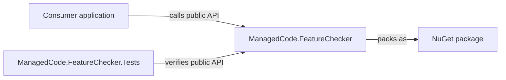
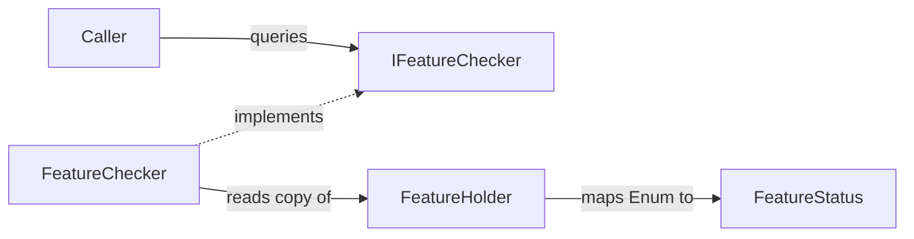
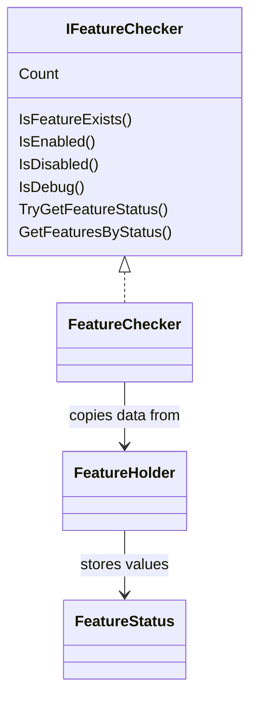

# FeatureChecker Architecture

Goal: understand what exists, where it lives, and how the library is verified.

## Summary

- System: a small .NET library for enum-based feature status checks.
- Code: `ManagedCode.FeatureChecker/` contains the packageable library; `ManagedCode.FeatureChecker.Tests/` contains TUnit tests.
- Entry points: `IFeatureChecker`, `FeatureChecker`, `FeatureHolder`, and `FeatureStatus`.
- Dependencies: the production project has no runtime package dependencies beyond the shared build packages from `Directory.Build.props`; tests use TUnit, Shouldly, and coverlet.

## Scoping

- Start with the module map below, then read the local `AGENTS.md` for the project being changed.
- Public API or semantics changes belong in the production project and must include tests.
- Test-only changes belong in `ManagedCode.FeatureChecker.Tests/`.
- CI, release, and package publishing work belongs in `.github/workflows/`, `Directory.Build.props`, and package metadata files.

## Diagrams

### System Map

### Contracts Map

### Key Types

## Navigation Index

### Modules

- `ManagedCode.FeatureChecker` - code: [ManagedCode.FeatureChecker/](../ManagedCode.FeatureChecker/); local rules: [ManagedCode.FeatureChecker/AGENTS.md](../ManagedCode.FeatureChecker/AGENTS.md).
- `ManagedCode.FeatureChecker.Tests` - code: [ManagedCode.FeatureChecker.Tests/](../ManagedCode.FeatureChecker.Tests/); local rules: [ManagedCode.FeatureChecker.Tests/AGENTS.md](../ManagedCode.FeatureChecker.Tests/AGENTS.md).
- `GitHub Actions` - workflows: [.github/workflows/](../.github/workflows/).

### Interfaces and Contracts

- `IFeatureChecker` - source: [IFeatureChecker.cs](../ManagedCode.FeatureChecker/IFeatureChecker.cs); implemented by `FeatureChecker`.
- `FeatureHolder` - source: [FeatureHolder.cs](../ManagedCode.FeatureChecker/FeatureHolder.cs); maps `Enum` keys to `FeatureStatus`.
- `FeatureStatus` - source: [FeatureStatus.cs](../ManagedCode.FeatureChecker/FeatureStatus.cs); defines `Disabled`, `Enabled`, and `Debug`.
- `Package metadata` - source: [Directory.Build.props](../Directory.Build.props) and [ManagedCode.FeatureChecker.csproj](../ManagedCode.FeatureChecker/ManagedCode.FeatureChecker.csproj).

### Key Types

- `FeatureChecker` - source: [FeatureChecker.cs](../ManagedCode.FeatureChecker/FeatureChecker.cs); default checker implementation.
- `IFeatureChecker` - source: [IFeatureChecker.cs](../ManagedCode.FeatureChecker/IFeatureChecker.cs); public abstraction.
- `FeatureHolder` - source: [FeatureHolder.cs](../ManagedCode.FeatureChecker/FeatureHolder.cs); mutable setup holder copied by the checker.
- `FeatureStatus` - source: [FeatureStatus.cs](../ManagedCode.FeatureChecker/FeatureStatus.cs); public feature state enum.

## Dependency Rules

- Production code should stay dependency-light and provider-agnostic.
- Tests may depend on TUnit, Shouldly, and coverage tooling.
- Storage, cloud, release-provider, or feature-provider integrations should be isolated behind explicit contracts before being added.
- Shared build policy lives in `Directory.Build.props` and `Directory.Packages.props`.

## Key Decisions

- No ADRs exist yet.
- Add ADRs under `docs/ADR/` for public API model changes, provider architecture, release policy shifts, or new runtime dependencies.

## Where To Go Next

- Root governance: [AGENTS.md](../AGENTS.md)
- Production project rules: [ManagedCode.FeatureChecker/AGENTS.md](../ManagedCode.FeatureChecker/AGENTS.md)
- Test project rules: [ManagedCode.FeatureChecker.Tests/AGENTS.md](../ManagedCode.FeatureChecker.Tests/AGENTS.md)
- Behaviour docs: `docs/Features/`
- Architecture decisions: `docs/ADR/`

