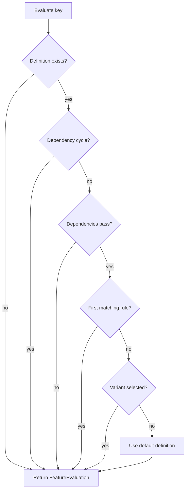

# Feature Evaluation

`FeatureChecker` evaluates a feature definition against an optional `FeatureEvaluationContext` and returns a `FeatureEvaluation`.

## Flow

## Ordering

1. Missing keys evaluate as disabled with reason `Missing`.
2. Dependency checks run before targeting rules.
3. Rules are evaluated in declaration order.
4. Rule conditions must all match.
5. Percentage rules require a non-empty targeting key and use deterministic hashing of feature key plus targeting key.
6. Weighted variants require a targeting key and use the same deterministic rollout approach.
7. If nothing else matches, the definition default status and value are returned.

## Context

`FeatureEvaluationContext` carries:

- `TargetingKey` for sticky rollout and variants.
- Case-insensitive string attributes for targeting rules.

Attribute values are converted using invariant culture for stable serialization and comparisons.

## Storage Boundary

The core package serializes `FeatureSnapshot` to JSON strings, streams, and files. This is the intended boundary for adapters:

- local files and GitOps repositories
- ManagedCode.Storage-backed object storage
- external feature/configuration sync jobs
- edge cache refresh jobs

Adapters should fetch and persist snapshots, then pass definitions into `FeatureChecker` through `FeatureSnapshot`, `FeatureFileProvider`, or `IFeatureDefinitionProvider`.
